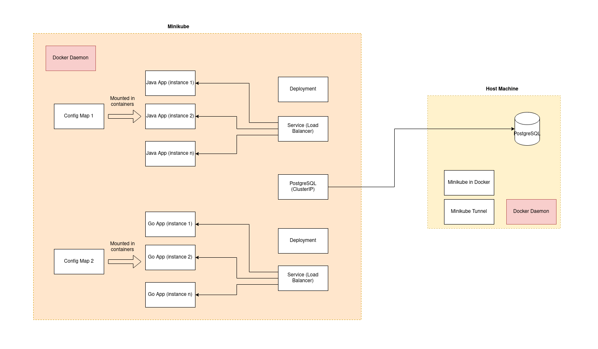

# CRUD App Go

## How to run

### Use Docker

#### Run using publicly hosted image
```bash
docker run -dt --name crud-app-go -p 8080:8080 -v </absolute/path/to/config.yaml>:/app/config/config.yaml srimaln91/crud-app-go:latest
```

#### Buid and Run

```bash
cd /path/to/project
make image
docker run -dt --name crud-app-go -p 8080:8080 <image>
```

The application will be listening on http port 8080.

#### Use custom configuration

You can use the custom config by mounting config.yaml file on the /app/config/config.yml mount point in the container.

```bash
docker run -dt --name crud-app-go -p 8080:8080 -v </absolute/path/to/config.yaml>:/app/config/config.yaml <image>
```

Following is a sample config file

```yaml
# Note: All duration values are in milliseconds
http:
  port: 8080

logger:
  level: "DEBUG"

database:
  host: localhost
  port: 5432
  name: dbname
  user: username
  password: *****
  pool_size: 5
  max_idle_connections: 2

  conn_max_lifetime: 300000

```

## Host applications in Kubernetes

### Architectural Diagram for Kuberntes setup



### Build image

The image will be tagged automatically based on git tags/revisions

Note: Have to point the shell to minikube Docker daemon before building images

```bash
 eval $(minikube -p minikube docker-env)
```

```bash
make image
```

### Create K8s resources

Kubernetes config files are placed in infra directory. Use the following command to apply configs

```bash
kubectl apply -R -f infra/
```

Configs contain the following resouce types which are required to run the application
01. deployment (infra/controllers/deployment.yaml)
02. config maps (infra/config/configmap.yaml)
03. service to create link with PostgreSQL node (infra/svc/postgres.yaml)
04. service to act as a load balancer (infra/svc/appService.yaml)

## TODO

01. Improve test coverage (Configure pipelines to run tests automatically and report coverage %)
02. Expose application matrices in prometheus format
03. improvements in logging
04. Write benchmarks on the hot code path
05. Automate docker builds on release tags
06. Store sensitive data in Secrets (databse passwords/usernames)
07. propagate correlation IDs through boundaries and write it in logs